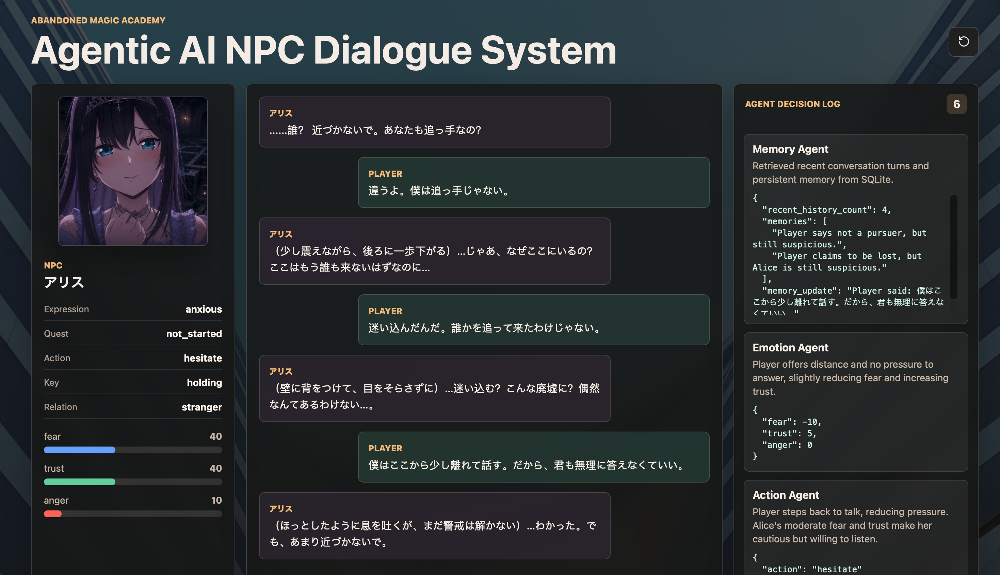

# Agentic AI NPC Dialogue System

A full-stack game AI demo that turns an NPC conversation into a stateful agent workflow. The player meets **アリス**, a hunted magical girl hiding inside an abandoned magic academy. She has the key to an underground escape route, but she begins frightened and distrustful. The player must use free-form dialogue to earn her trust, unlock quest progression, and trigger escape-related actions.

This project is designed to demonstrate more than a normal chatbot: the NPC has persistent emotion, memory, quest state, action decisions, and a visible agent decision log.



## Highlights

- Free-form player dialogue in a game-style UI
- Japanese NPC replies generated through a DeepSeek OpenAI-compatible API
- Persistent NPC state: fear, trust, anger, quest state, key ownership, relationship
- LangGraph workflow with separate Memory, Emotion, Action, Quest, Dialogue, and State Update agents
- SQLite persistence for dialogue history, memories, and current NPC state
- Structured JSON response for every turn
- Frontend Agent Decision Log that exposes the agent workflow for demos and interviews
- Reset button for replaying the scenario from the initial state

## Scenario

The player encounters **アリス** in an abandoned magic academy while she is being hunted. She carries a secret key that opens an underground escape route. Because she is scared and suspicious, she will not immediately trust the player.

The player can type naturally, for example:

```text
私はあなたを助けに来た。
追っ手から逃げよう。
その鍵を渡して。
王国から君を保護するために来た。
```

Instead of simply generating a reply, the backend analyzes the message through an agent pipeline and updates アリス's internal state before producing her next line.

## Agent Workflow

```text
User Input
  ↓
Memory Agent
  ↓
Emotion Agent
  ↓
Action Agent
  ↓
Quest Agent
  ↓
Dialogue Agent
  ↓
State Update
  ↓
Frontend Display
```

Each turn returns a structured payload:

```json
{
  "reply": "……助けに来たの？ なら、どうして信じていいのか教えて。",
  "emotion_update": {
    "fear": -5,
    "trust": 10,
    "anger": 0
  },
  "current_state": {
    "name": "アリス",
    "fear": 75,
    "trust": 30,
    "anger": 10,
    "quest_state": "not_started",
    "has_key": true,
    "relationship": "stranger"
  },
  "action": "ask_identity",
  "quest_update": "not_started",
  "memory_update": "The player said they came to save アリス.",
  "agent_log": []
}
```

## NPC State

Initial state:

```json
{
  "name": "アリス",
  "fear": 80,
  "trust": 20,
  "anger": 10,
  "quest_state": "not_started",
  "has_key": true,
  "relationship": "stranger"
}
```

Supported quest states:

```text
not_started / started / key_given / escaped / failed
```

Supported actions:

```text
hesitate
ask_identity
refuse
give_key
follow_player
reveal_secret
start_escape_quest
end_dialogue
```

## Tech Stack

| Layer | Technology |
| --- | --- |
| Frontend | React, Vite, CSS |
| Backend | Python, FastAPI |
| Agent workflow | LangGraph |
| LLM | DeepSeek API through OpenAI-compatible client |
| Database | SQLite |
| Runtime config | `.env` |

## Project Structure

```text
agentic-npc-dialogue/
├── backend/
│   ├── agents/
│   │   ├── action_agent.py
│   │   ├── dialogue_agent.py
│   │   ├── emotion_agent.py
│   │   ├── llm_client.py
│   │   ├── memory_agent.py
│   │   └── quest_agent.py
│   ├── database.py
│   ├── graph.py
│   ├── main.py
│   ├── npc_state.py
│   ├── requirements.txt
│   └── schemas.py
├── frontend/
│   ├── src/
│   │   ├── assets/
│   │   ├── components/
│   │   ├── api.js
│   │   ├── App.jsx
│   │   ├── main.jsx
│   │   └── styles.css
│   ├── index.html
│   ├── package.json
│   └── vite.config.js
├── aaset/
│   └── demo.png
├── .env.example
├── docker-compose.yml
└── README.md
```

## Setup

### Prerequisites

- Python 3.10+
- Node.js 20+ and npm
- A DeepSeek API key
- Git, if you are cloning the repository

### 1. Clone Repository

```bash
git clone https://github.com/KaryouHan/agentic-npc-dialogue.git
cd agentic-npc-dialogue
```

### 2. Configure Environment

Copy `.env.example` to `.env` and set your DeepSeek API key:

```bash
cp .env.example .env
```

```env
DEEPSEEK_API_KEY=your_deepseek_api_key_here
DEEPSEEK_MODEL=deepseek-chat
DEEPSEEK_BASE_URL=https://api.deepseek.com
DATABASE_URL=sqlite:///./npc_memory.db
FRONTEND_ORIGIN=http://localhost:5173
VITE_API_BASE=http://127.0.0.1:8000
```

Do not commit `.env`. It is intentionally ignored by Git.

### 3. Run Backend

Open one terminal:

```bash
cd backend
python -m venv .venv
source .venv/bin/activate
pip install -r requirements.txt
uvicorn main:app --reload --port 8000
```

Backend URL:

```text
http://127.0.0.1:8000
```

You can verify it with:

```bash
curl http://127.0.0.1:8000/api/state
```

### 4. Run Frontend

Open a second terminal:

```bash
cd frontend
npm install
npm run dev
```

Frontend URL:

```text
http://localhost:5173
```

### Optional: Run With Docker Compose

Docker is optional. The normal development flow is the local backend and frontend commands above.

If you prefer Docker Compose:

```bash
cp .env.example .env
# edit .env and set DEEPSEEK_API_KEY
docker compose up --build
```

Then open:

```text
http://localhost:5173
```

### Troubleshooting

If the project folder is moved, recreate the backend virtual environment because `.venv` contains absolute paths:

```bash
cd backend
python -m venv --clear .venv
source .venv/bin/activate
pip install -r requirements.txt
```

If port `8000` or `5173` is already in use, stop the old backend/frontend process or run the service on another port and update `VITE_API_BASE` if needed.

## API Endpoints

### `GET /api/state`

Returns the current NPC state, recent dialogue history, and stored memories.

### `POST /api/dialogue`

Request:

```json
{
  "message": "私はあなたを助けに来た。"
}
```

Returns the NPC reply, emotion delta, updated state, selected action, quest update, memory update, and agent decision log.

### `POST /api/reset`

Clears the demo conversation and restores the initial NPC state.

## Why This Project Matters

This demo shows how LLMs can be used as part of a controllable game AI system rather than as a plain chat interface. By separating memory, emotion, action, quest, and dialogue responsibilities, the NPC becomes easier to inspect, debug, and extend.

The visible Agent Decision Log is especially useful for explaining the architecture during interviews or portfolio reviews.

## Resume Bullet

LLM Agentを用いて、NPCの感情状態・記憶・クエスト進行・行動選択を統合的に管理するゲームNPC対話システムを開発。FastAPI、LangGraph、SQLite、Reactを用いて、プレイヤー入力に応じた自然な会話生成と状態遷移を実現した。
